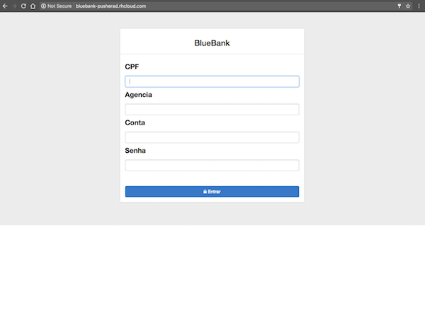
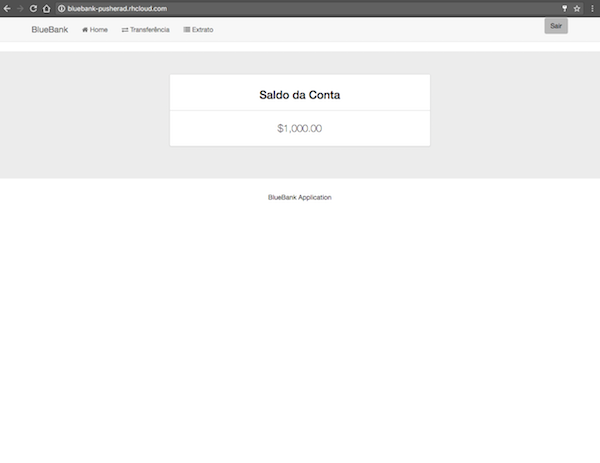
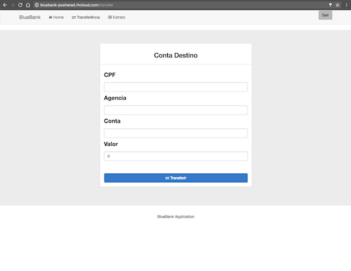
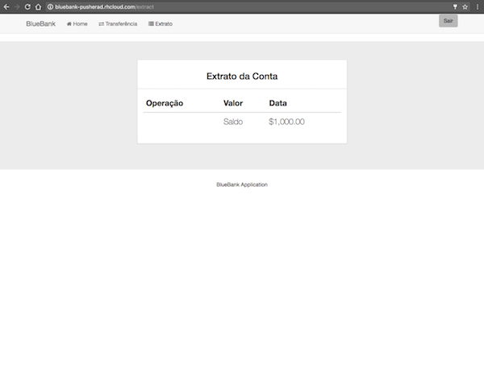

# Blue Bank
A aplicação pode ser acessada em [BlueBank on Openshift](http://bluebank-pusherad.rhcloud.com)

Projeto desenvolvido 100% utilizando tecnologias Spring com Injeção de dependências Services e compomentes customizados.

Para controle de transação utilizado Transaction para garantir o I/O nas operações.

Gradle build system e 99% de cobertura com testes unitários e integrados.

Projeto pode ser executado com java -jar ou implantado em servidores de aplicações.

## Instruções

<pre>
Clone o projeto git clone https://github.com/rbarbioni/bluebank.git

cd bluebank

gradlew build

java -jar build/libs/bluebank-0.0.1-SNAPSHOT.war

Para facilitar o deploy, as dependências do front-end formam incluídas no projeto, caso haja problemas com com o from execute:

cd src/main/resources/public

sudo npm install
</pre>

## Tecnologias
- Spring-Boot;
- Spring-Data-JPA;
- Spring-Security;
- Spring-Web;
- JWT;
- Hibernate;
- AngularJS;
- Bootstrap;
- HTML5

## Sobre o projeto

Foi desenvolvido autenticação, consulta de saldo, transferência e extrato, onde é um resumo de uma tabela de Log que registra as operações contábeis.

Para facilitar, está implementado o sistema de inicialização de tabelas que irá popular com algumas contas para os tests serem realizados, abaixo a tablela.

CPF | Agencia | Conta | Senha | Saldo |
------------ | ------------- | ------------ | ------------ | ------------ |
31449881114 | 1000 | 10000 | password | 1.000,00 |
65261248876 | 2000 | 20000 | password | 1.000,00 |
28865762128 | 3000 | 30000 | password | 1.000,00 |
93041807084 | 4000 | 40000 | password | 1.000,00 |
14140472669 | 5000 | 50000 | password | 1.000,00 |
------------ | ------------- | ------------ | ------------ | ------------ |

## Screenshots

Login

Home

Home

Extrato

